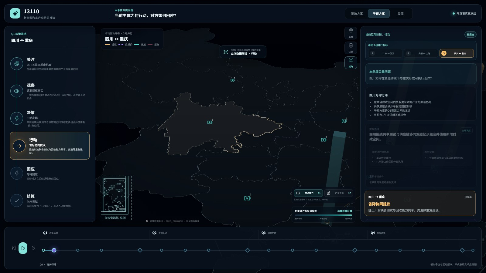
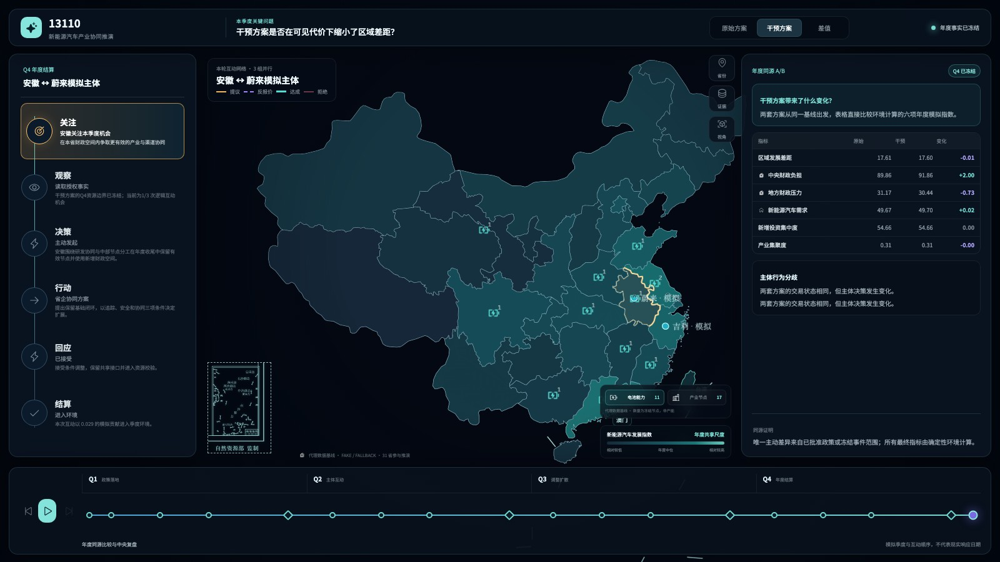
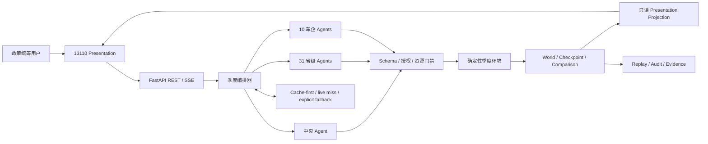

# 13110

**抖音 AI 创变者计划 2026 北京全国总决赛作品**

> 面向中央政策统筹场景的新能源汽车产业协同多智能体推演平台

13110 将政策调整放入可审计的同源 A/B 模拟环境，让中央、31 个省级 Agent 与 10 家代表性车企模拟 Agent 在约束中动态互动，并把策略、消息、环境结算和年度差异串成可回放的证据链。

它帮助政策研究与跨区域协同团队在讨论方案前显式检查传导假设、主体反应和政策权衡；产品用于机制推演与方案比较，不替代现实预测或人工决策。`PolicyScope` 仅作为代码标识和历史版本名保留。

## 产品实景

### 季度主体互动



中央政策信号、省域与车企主体、跨主体连线、因果链和季度章节在同一张可回放画布中呈现。

### 年度同源 A/B 对比



年度比较只展示模拟指标和相对变化，并保留从指标回到季度决策、互动消息和证据的追溯路径。

## 产品闭环

```text
政策输入与人工审批
  → 中央 Agent 结构化解读与实验设计
  → 冻结 Baseline 与不可变 Checkpoint
  → 派生 Control / Treatment 同源分支
  → Q1—Q4 省级与车企 Agent 条件激活
  → 每季度确定性环境结算与 Checkpoint
  → Q4 年度 Comparison
  → Replay / Audit / Evidence
```

Control 与 Treatment 不是随机重跑：两条路径从同一不可变 Checkpoint 派生，冻结数据基线、主体画像、环境版本和事件条件，只允许用户审批的政策变量不同。

```text
                  Same Checkpoint
                  /             \
          Control World     Treatment World
              原始方案           干预方案
                  \             /
                   Compare 相对差异
```

## 四项核心能力

| 能力 | 13110 如何实现 |
|---|---|
| 中央政策编排 | 将政策文本转为结构化实验设计，经人工确认后冻结同源 A/B 基线 |
| 多主体协同 | 31 个省级主体与 10 家车企主体按消息、事件、计划到期和未决事务动态激活 |
| 确定性环境 | Schema、身份、授权和资源门禁校验行动；指标、守恒与季度结算由代码完成 |
| 证据与因果展示 | 关联逻辑时间、决策、互动、Checkpoint、Comparison 与来源证据，支持回放审计 |

模型负责生成受约束的主体决策候选，不直接修改权威 WorldState，也不生成最终宏观指标。前端只读渲染已提交事实，不从文案或动画反推业务结果。

## 系统架构



主要技术栈：Python 3.11+、FastAPI、Pydantic、React、TypeScript、MapLibre / deck.gl、SSE、Pytest、Vitest 与 Playwright。

## 当前能力与边界

### M34 · 动态季度互动运行时

- `Q1—Q4` 逻辑时间和最多三波季度因果顺序；
- 主体按新消息、计划到期、可见事件和未决事务动态激活；
- 双向发起、报价、回应、结算的会话状态机；
- 资源守恒、纯函数环境结算、不可变 Checkpoint 和年度对比；
- REST / SSE 中保留逻辑时间、消息与会话追踪 ID。

### M35 · 全景因果舞台

- `apps/presentation` 是当前产品界面，覆盖全国主体博弈、季度互动和年度 A/B 结果；
- 31 省进入计算，港澳台和南海诸岛仅作为地图上下文；
- WebGL 主路径具备 SVG 兼容渲染、低动效和多分辨率适配；
- `apps/web` 保留为历史研究工作台，`apps/roadshow` 是不读取模拟状态的独立开场叙事层。

### 研究边界

- 不输出未来真实 GDP、就业、投资、产能或销量预测；
- 不代表现实政府部门、地方政府或企业的真实行为；
- 现实数据用于冻结基线和主体上下文，派生机制字段按 proxy 或 scenario assumption 管理；
- Q1—Q4 是逻辑时间，不暗示现实主体的响应日期或速度；
- 结果用于比较机制、定位分歧和追溯证据，最终判断始终由人作出。

完整验证口径、缓存质量门禁与视觉验收记录见[验证文档](./docs/validation/)。

## 仓库结构

```text
apps/
  api/             FastAPI、REST / SSE 与运行时投影
  presentation/    当前 13110 产品界面
  roadshow/        独立开场叙事与离线构建
  web/             历史研究工作台
simulation/        Agent、编排、互动机制与确定性环境
data/              冻结数据基线与场景输入
config/            实验与运行配置
docs/              产品、架构、验证、部署与数据文档
runtime/           本地运行时产物说明；缓存不进入 Git
scripts/           仓库、数据、地图和展示校验工具
deploy/m35/        M35 容器与生产部署配置
```

## 快速开始

环境要求：Python 3.11—3.13、Node.js 22、GNU Make。

```bash
make setup
make check
```

分别在两个终端启动 API 与当前 Presentation：

```bash
make dev-api
make dev-presentation
```

`make dev-api` 默认使用确定性 fake Provider，适合本地开发和回归。Cache-first + live miss 需按 [`.env.example`](./.env.example) 配置服务端环境；密钥不得进入前端或 Git。

其他统一入口：

```bash
make test          # Python、Web、Presentation 与 Roadshow 测试
make build         # 三套前端生产构建
make docker-build  # 自包含 API 与 Presentation 镜像
```

## 文档、数据与许可

- [文档导航](./docs/README.md)
- [数据来源与口径](./docs/data/)
- [安全报告方式](./SECURITY.md)
- [权利声明](./NOTICE.md)
- [第三方许可说明](./THIRD_PARTY_NOTICES.md)

本仓库未授予开源许可。代码、数据、地图、字体与其他第三方材料分别受其权利声明和来源条款约束。
