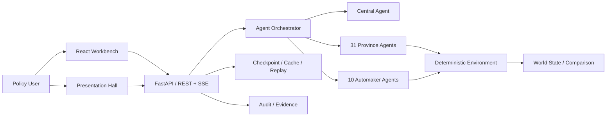

# PolicyScope / 13110

> **面向中央政策统筹场景的新能源汽车多智能体政策推演平台**

**31 Province Agents · Automaker Agents · Counterfactual A/B · Checkpoint / Replay / Audit · React + FastAPI**

PolicyScope 不是用 Agent 去“预测未来”，而是把政策调整放进一个可审计的模拟环境里，观察不同主体会如何响应，并比较两条同源分支之间的机制差异。

当前主问题是：

> 当中央调整新能源汽车补贴中不同区域的中央承担比例后，各省如何改变补贴策略，企业如何重新配置资源，最终区域发展差距、财政压力与产业集中度会如何变化？

结果以**模拟指数和相对变化**呈现，用于方案比较，不代表现实政府或企业未来决定。

---

## 这个项目为什么值得看

很多 Multi-Agent Demo 的核心仍然是“多个角色轮流聊天”。PolicyScope 尝试进一步解决三个问题：

1. **Agent 决策如何进入一个真正会变化的环境；**
2. **如何保证 A/B 两个世界只改变一个主动变量；**
3. **如何把每个主体的行为、证据与结果完整记录下来，便于审计和回放。**

因此系统把 LLM Agent 与确定性环境分离：

```text
政策输入
  ↓
中央解读 / 实验设计
  ↓
同一 Checkpoint 派生 A / B
  ↓
31 省级 Agent 行动
  ↓
车企 Agent 响应
  ↓
省际 / 省企互动
  ↓
确定性环境结算
  ↓
ΔGap + 财政 + 需求 + 投资集中度
  ↓
Replay / Audit / Evidence
```

## 当前规模

当前 V3.2 运行时包含：

- **31 个省级 Agent**；
- **10 家代表性车企模拟 Agent**；
- 一场完整双分支实验包含 **226 次结构化主体调用**；
- Agent 上下文接入 **4,527 条事实、711 项特征、282 条关系边**；
- 支持政策对比、政策压力测试、事件反事实三类实验；
- 支持 Checkpoint、Replay、Audit、Evidence 和 REST / SSE 运行链路；
- 地图工作台与全景推演厅可展示全国状态、主体互动和 A/B 差异。

## 核心设计：同源反事实

PolicyScope 的 A/B 不是“重新随机跑两遍”。

两个世界从同一个不可变 Checkpoint 派生，并冻结除目标变量之外的实验条件：

```text
          Same Checkpoint
          /             \
         /               \
   Control World     Treatment World
   原始政策             调整后的政策
         \               /
          \             /
          Compare Δ
```

这使得最终差异更接近回答：

> **“如果只有这个政策变量发生变化，会发生什么？”**

而不是比较两次彼此不可控的 Agent 生成结果。

## 三级主体

### 中央 Agent

负责将政策输入整理为结构化实验指令和复盘建议，但不能绕过用户审批或直接写入最终指标。

### 31 个省级 Agent

每个省份结合自身画像与上下文，在财政空间、产业基础、需求、供应链、人才等约束下配置地方支持策略，并在实验中响应其他省份和企业行为。

主要政策工具包括：

- 消费端补贴；
- 固定成本支持；
- 可变成本支持；
- 省际协同；
- 面向企业的资源包与响应。

### 车企 Agent

当前固定使用 10 家代表性新能源汽车企业作为模拟主体。每个 Agent 在全国 31 省之间重新配置销售 / 渠道资源，并可提出有限数量的建厂、扩产或延迟行动。

真实销量、财报、产能和工厂布局仅用于冻结基线；模拟输出不表示企业真实计划或承诺。

## Agent 与环境分工

这是项目最重要的工程边界之一。

**Agent 负责选择策略：**

- 做什么；
- 为什么做；
- 为什么不选其他方案；
- 什么条件变化会改变选择；
- 当前选择的机会成本。

**确定性环境负责计算结果：**

- 区域差距；
- 财政压力；
- 需求变化；
- 资源迁移；
- 投资集中度；
- 产业集聚度。

因此 Agent 不直接“编一个 GDP / 销量 / 财政结果”。

`DecisionTrace v3` 保存结构化决策记录，但不保存模型私有思维链。

## 核心指标

系统当前固定比较六类中央指标：

1. 区域发展差距；
2. 中央财政负担；
3. 地方财政压力；
4. 新能源汽车需求；
5. 新增投资集中度；
6. 产业集聚度。

其中核心公平指标：

```text
ΔGap = Gap_treatment − Gap_control
```

- `ΔGap < 0`：干预方案下区域差距缩小；
- `ΔGap > 0`：干预方案下区域差距扩大；
- `ΔGap ≈ 0`：当前机制和显示精度下影响有限。

## 产品界面

正式产品包含研究工作台和全景推演厅两套表现形态。

研究工作台主要路由：

```text
/experiments/new
/experiments/:id/live
/experiments/:id/provinces/:provinceCode
/experiments/:id/intervention
/experiments/:id/compare
```

Live 以中国地图为主画布，可查看地方支持强度、WTP、产业基础、车企销售投入等图层；Compare 使用同口径 A/B 视图优先展示 `ΔGap` 与政策差异。

全景推演厅进一步强化省—省、省—企之间的行动、响应和资源迁移，用于现场演示复杂 Agent interaction，而不是只展示最终 KPI。

## 技术架构



## 可审计性

为了避免“Agent 说了什么就算什么”，系统显式保存：

- 实验输入与版本；
- 数据基线与 Evidence；
- 主体结构化行动；
- Control / Treatment 分支关系；
- Checkpoint；
- DecisionTrace；
- 环境结算结果；
- Replay / Audit 信息；
- Provider / fallback 状态。

本地规则 fallback 会明确标记，不会写入或冒充线上模型缓存。

## 运行模式

项目支持三种模式：

- `fake`：确定性 Mock Provider，用于本地稳定开发；
- `cache`：使用完整预生成实验缓存进行稳定回放；
- `live`：配置 Provider 后执行线上结构化 Agent 调用，失败时显式记录 fallback。

## 本地启动

环境要求：Python 3.11+、Node.js 20+。

```bash
make setup
make dev-api
make dev-web
make dev-presentation
```

默认开发地址：

```text
Workbench:          http://localhost:5173/experiments/new
Presentation Hall:  http://localhost:4180
API:                http://localhost:8000
```

## 验证与测试

当前仓库包含多层验证：

- Python / API tests；
- React component tests；
- Ruff / formatter / ESLint / TypeScript build；
- 31 省数据与地图校验；
- Playwright E2E；
- SSE reconnect / fallback 测试；
- 1280、1080p、2K、4K 多画布演示验收；
- Design QA 与截图矩阵。

详细验证证据见 [Design QA](./docs/validation/design-qa.md) 与 [M33 最终验收](./docs/validation/M33_PRESENTATION_FINAL_VALIDATION.md)。

## 文档导航

- [V3.2 PRD](./PRD_省域政策多智能体推演平台.md)
- [开发计划](./DEVELOPMENT_PLAN.md)
- [前端规范](./docs/specs/STITCH_FRONTEND_SPEC.md)
- [Presentation Hall Spec](./docs/specs/PRESENTATION_HALL_SPEC.md)
- [Agent 开发约束](./AGENTS.md)
- [Design QA](./docs/validation/design-qa.md)

## 当前研究边界

PolicyScope 是一个**机制推演与方案比较工具**，不是现实预测系统。

- 不输出未来真实 GDP、就业、投资金额或销量预测；
- 不代表现实政府部门、地方政府或企业的真实行为；
- 真实数据主要用于冻结基线与上下文；
- 派生敏感度和部分机制字段会明确标记为 proxy / scenario assumption；
- Agent 生成与确定性结算保持分离。

## 这个项目主要证明什么

PolicyScope 是我对 **复杂 Multi-Agent 产品工程** 的一次完整探索：

- 如何让几十个 Agent 不只是线性聊天，而是真正进入共享环境；
- 如何设计 Agent orchestration、结构化输出与主体间互动；
- 如何用 Checkpoint 和 A/B 分支构造可解释反事实；
- 如何把真实数据、规则环境、LLM Agent 和前端地图整合成一个完整系统；
- 如何让一个 Hackathon 原型继续迭代到可测试、可回放、可审计的产品架构。